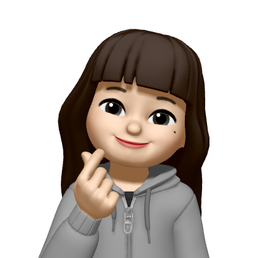

# 부모 복제 AI 서비스 : "CLONING"

 

<h2>👩‍👩‍👧‍👧 팀원 소개</h2>

<h3>💻 FE Developer</h3>

<table>
  <tbody>
    <tr>
      <td align="center">
        <a href="https://github.com/yangsy02"> <b>양서연</b></a> 
      </td>
      <td align="center">
        <a href="https://github.com/jisooooooooooo"> <b>임지수</b></a> 
      </td>
    </tr>
    <tr>
      <td align="center">FE</td>
      <td align="center">FE</td>
    </tr>
  </tbody>
</table>

<h3>💻 BE Developer</h3>
<table>
  <tbody>
    <tr>
      <td align="center">
        <a href="https://github.com/cherishwish"> <b>소원</b></a> 
      </td>
      <td align="center">
        <a href="https://github.com/soyoon1"> <b>조소윤</b></a> 
      </td>
      <td align="center">
        <a href="https://github.com/Soibecameit
"> <b>홍다인</b></a> 
      </td>
    </tr>
    <tr>
      <td align="center">BE</td>
      <td align="center">BE</td>
      <td align="center">BE</td>
    </tr>
  </tbody>
</table>
 

